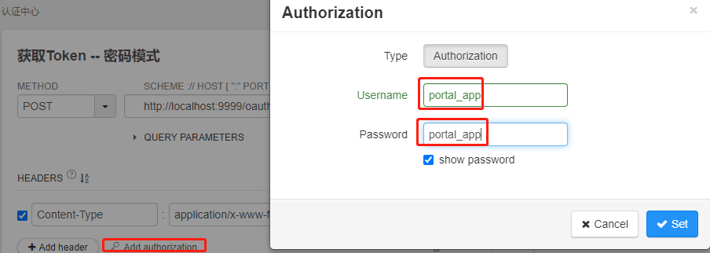
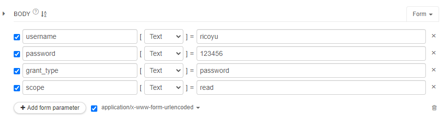
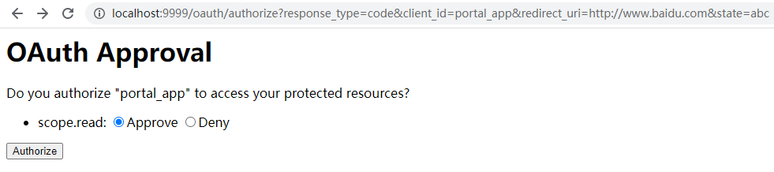
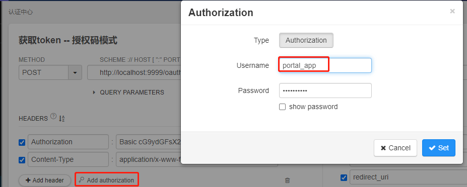
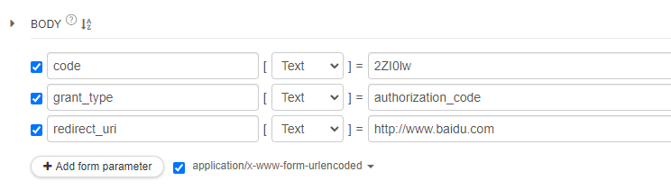

# 一 启动步骤

1. nacos

   ```shell
   D:\nacos\bin\startup.cmd -m standalone
   ```

2. sentinel

   就在本项目根目录下, 是一个持久化规则到Nacos的修改版本, 网关规则持久化也做了

   ```shell
   java -jar -Dserver.port=9090 D:\Learning\awesome-cloud\sentinel-dashboard.jar
   ```

   http://localhost:9090/

   指定Nacos地址, 启动Dashboard的时候加 -Dnacos.host=localhost:8848

3. seata TC

   ```shell
D:\seata\bin\seata-server.bat
   ```
   
   三个微服务里面的schema.sql已经包含了业务表和AT模式需要的undo_log表了

4. Skywalking

   ```shell
D:\skywalking\bin\startup.bat
   ```
   
   http://localhost:8080/

5. 微服务接入Skywalking, 需要加入一下JVM 参数

   ```shell
    -javaagent:D:\skywalking\agent\skywalking-agent.jar -Dskywalking.agent.service_name=gateway-service -Dskywalking.collector.backend_service=127.0.0.1:11800 
   ```

## 1.1 微服务启动顺序

### 1.1.1 组合1

演示RestTemplate加上@LoadBalanced注解后便具有:

* ribbon客户端负载均衡功能
* 根据微服务名称来调用

1. awesome-service
   * server.port设为0, 就是每次启动分配一个随机端口号, Idea要允许它启动多个instance
   * 这个不需要连数据库
2. portal-service
   * 通过restTemplate.getForObject("http://awesome-service/aws/port", String.class);来循环调用awesome-service 100次, 拿到端口号
   * 演示了sentinel的限流, 关注限流发生后如何处理的异常

## 1.2 微服务说明

### 1.2.1 auth-gateway-service

引入了

```xml
<dependency>
    <groupId>com.loserico</groupId>
    <artifactId>loser-cloud-gateway-starter</artifactId>
    <version>2.6.2</version>
</dependency>
```


## 数据库脚本

数据库脚本在每个module下都有schema.sql

## Nacos增加配置

public namespace里面新建

### 1 account-datasource.yaml

```yaml
spring:
  datasource:
    type: com.alibaba.druid.pool.DruidDataSource
    druid:
      driver-class-name: com.mysql.cj.jdbc.Driver
      url: jdbc:mysql://localhost:3306/seata_at_account?useUnicode=true&characterEncoding=UTF-8&serverTimezone=Asia/Shanghai
      username: seata
      password: 123456
      initial-size: 10
      max-active: 100
      min-idle: 10
      max-wait: 60000
      pool-prepared-statements: true
      max-pool-prepared-statement-per-connection-size: 20
      time-between-eviction-runs-millis: 60000
      min-evictable-idle-time-millis: 300000
      test-while-idle: true
      test-on-borrow: false
      test-on-return: false
      stat-view-servlet:
        enabled: true
        url-pattern: /druid/*
      filter:
        stat:
          log-slow-sql: true
          slow-sql-millis: 1000
          merge-sql: false
        wall:
          config:
            multi-statement-allow: true
```

### 2 auth-datasource

```yaml
spring:
  datasource:
    type: com.alibaba.druid.pool.DruidDataSource
    druid:
      driver-class-name: com.mysql.cj.jdbc.Driver
      url: jdbc:mysql://localhost:3306/oauth?useUnicode=true&characterEncoding=UTF-8&serverTimezone=Asia/Shanghai
      username: oauth
      password: 123456
      initial-size: 10
      max-active: 100
      min-idle: 10
      max-wait: 60000
      pool-prepared-statements: true
      max-pool-prepared-statement-per-connection-size: 20
      time-between-eviction-runs-millis: 60000
      min-evictable-idle-time-millis: 300000
      test-while-idle: true
      test-on-borrow: false
      test-on-return: false
      stat-view-servlet:
        enabled: true
        url-pattern: /druid/*
      filter:
        stat:
          log-slow-sql: true
          slow-sql-millis: 1000
          merge-sql: false
        wall:
          config:
            multi-statement-allow: true
```


### 3 order-datasource.yaml

```yaml
spring:
  datasource:
    type: com.alibaba.druid.pool.DruidDataSource
    druid:
      driver-class-name: com.mysql.cj.jdbc.Driver
      url: jdbc:mysql://localhost:3306/seata_at_order?useUnicode=true&characterEncoding=UTF-8&serverTimezone=Asia/Shanghai
      username: seata
      password: 123456
      initial-size: 10
      max-active: 100
      min-idle: 10
      max-wait: 60000
      pool-prepared-statements: true
      max-pool-prepared-statement-per-connection-size: 20
      time-between-eviction-runs-millis: 60000
      min-evictable-idle-time-millis: 300000
      test-while-idle: true
      test-on-borrow: false
      test-on-return: false
      stat-view-servlet:
        enabled: true
        url-pattern: /druid/*
      filter:
        stat:
          log-slow-sql: true
          slow-sql-millis: 1000
          merge-sql: false
        wall:
          config:
            multi-statement-allow: true
```

### 4 storage-datasource.yaml

```yaml
spring:
  datasource:
    type: com.alibaba.druid.pool.DruidDataSource
    druid:
      driver-class-name: com.mysql.cj.jdbc.Driver
      url: jdbc:mysql://localhost:3306/seata_at_storage?useUnicode=true&characterEncoding=UTF-8&serverTimezone=Asia/Shanghai
      username: seata
      password: 123456
      initial-size: 10
      max-active: 100
      min-idle: 10
      max-wait: 60000
      pool-prepared-statements: true
      max-pool-prepared-statement-per-connection-size: 20
      time-between-eviction-runs-millis: 60000
      min-evictable-idle-time-millis: 300000
      test-while-idle: true
      test-on-borrow: false
      test-on-return: false
      stat-view-servlet:
        enabled: true
        url-pattern: /druid/*
      filter:
        stat:
          log-slow-sql: true
          slow-sql-millis: 1000
          merge-sql: false
        wall:
          config:
            multi-statement-allow: true
```

3 account-datasource.yaml

```yaml
spring:
  datasource:
    type: com.alibaba.druid.pool.DruidDataSource
    druid:
      driver-class-name: com.mysql.cj.jdbc.Driver
      url: jdbc:mysql://localhost:3306/seata_at_account?useUnicode=true&characterEncoding=UTF-8&serverTimezone=Asia/Shanghai
      username: seata
      password: 123456
      initial-size: 10
      max-active: 100
      min-idle: 10
      max-wait: 60000
      pool-prepared-statements: true
      max-pool-prepared-statement-per-connection-size: 20
      time-between-eviction-runs-millis: 60000
      min-evictable-idle-time-millis: 300000
      test-while-idle: true
      test-on-borrow: false
      test-on-return: false
      stat-view-servlet:
        enabled: true
        url-pattern: /druid/*
      filter:
        stat:
          log-slow-sql: true
          slow-sql-millis: 1000
          merge-sql: false
        wall:
          config:
            multi-statement-allow: true
```

### 5 jpa-config.yaml

```yaml
spring:
  jpa:
    properties:
      hibernate:
        dialect: org.hibernate.dialect.MySQLDialect
        archive:
          scanner: org.hibernate.boot.archive.scan.internal.StandardScanner #解决新版Hibernate找不到hbm.xml文件问题
        show_sql: true
        format_sql: true
        ddl-auto: none
        jdbc.batch_size: 100
        order_inserts: true
        order_updates: true
        jdbc.time_zone: Asia/Shanghai
        generate_statistics: false
        cache:
          use_second_level_cache: false
          use_query_cache: false
        entitymanager:
          class: org.springframework.orm.jpa.LocalContainerEntityManagerFactoryBean
          mappingDirectoryLocations: classpath:named-sql
        packagesToScan: com.loserico.cloud.entity
```

### 6 ribbon-config.yaml

```yaml
#这是默认的负载均衡策略    
ribbon:
  NFLoadBalancerRuleClassName: com.alibaba.cloud.nacos.ribbon.NacosRule
  http:
    client:
      enabled: true
  eager-load:
    enabled: true
    clients: order-service
  #和其他服务(如product-service)建立HTTP连接的超时时间
  ConnectTimeout: 1000
  #建立HTTP后, 读取HTTP返回结果的超时时间
  ReadTimeout: 1000
  #每一台服务器重试的次数, 不包含首次调用的那一次(意思就是调2次)
  MaxAutoRetries: 1
  #重试的服务器个数, 不包含首次调用的那一台实例(如: product-service有4个实例, 如果第一个实例调不通, 会调用剩下3个实例中的2个)
  MaxAutoRetriesNextServer: 2
  #如果设为true, 那么post, put请求会重试, 可能导致表单重复提交
  OKToRetryOnAllOperations: false
```

### 7 feign-config.yaml

```yaml
feign:
  sentinel:
    enabled: true
  okhttp:
    enabled: false
  httpclient:
    enabled: true
    #最大连接数
    max-connections: 200
    #为每个url请求设置最大连接数
    max-connections-per-route: 50
    connection-timeout: 1000
    time-to-live: 900
  client:
    config:
      default:
        connectTimeout: 1000
        readTimeout: 10000
      order-service:
        connectTimeout: 5000
        readTimeout: 10000
        loggerLevel: FULL
        requestInterceptors:
          - com.loserico.cloud.interceptor.RequestHeaderInterceptor
  compression:
    request:
      enabled: true
      mime-types: text/xml,application/xml,application/json
      min-request-size: 2048
    response:
      enabled: true 
```


## 测试接口

测试下单接口: http://localhost:8081/order/createOrder

```json
{
  "userId":'1001', 
  "commodityCode":"2001", 
  "count": 2, 
  "money": 100
}
```

账号1001的余额是40, 这条数据是不够扣的, 所以事务应该回滚

## 调用链路

.png)

# Oauth2认证中心

appSecret都是123456

## 密码模式

密码模式获取token

POST http://localhost:9999/oauth/token





## 授权码模式

http://localhost:9999/oauth/authorize?response_type=code&client_id=portal_app&redirect_uri=http://www.baidu.com&state=abc

访问这个链接会显示一个登录页面, 这是认证服务器提供的登录页面


账号配置的是任何账号, 密码是123456

登录成功后跳转到这个页面



点approve


然后用code去换token





是redirect_uri

然后就可以拿到token

```json
{
    "access_token": "4f5eb359-98c6-49f4-8fd5-a9853a86ab15",
    "token_type": "bearer",
    "expires_in": 3600,
    "scope": "read"
}
```

## 数据库存储说明

客户端信息都存在数据库里了, token也改存Redis了

### 数据库schema

```mysql
drop database if exists oauth;
create database oauth default character set utf8mb4 default collate utf8mb4_general_ci;
grant all on oauth.* to 'oauth'@'%' identified by '123456';
flush privileges;
use oauth;

create table oauth_client_details
(
    client_id               VARCHAR(256) PRIMARY KEY,
    client_secret           VARCHAR(256),
    resource_ids            VARCHAR(256),
    scope                   VARCHAR(256),
    authorized_grant_types  VARCHAR(256),
    web_server_redirect_uri VARCHAR(256),
    authorities             VARCHAR(256),
    access_token_validity   INTEGER,
    refresh_token_validity  INTEGER,
    additional_information  VARCHAR(4096),
    autoapprove             VARCHAR(256)
);

INSERT INTO `oauth_client_details` (`client_id`, `client_secret`, `resource_ids`, `scope`, `authorized_grant_types`, `web_server_redirect_uri`, `authorities`, `access_token_validity`, `refresh_token_validity`, `additional_information`, `autoapprove`) VALUES ('order_app', '$2a$10$zwvk3xuIn2/ewrgvULLr8OGJcMbIIpnZ5z/BBI0OQqOxs9/JIJkPy', 'order-service', 'read', 'password', NULL, NULL, 1800, NULL, NULL, NULL);
INSERT INTO `oauth_client_details` (`client_id`, `client_secret`, `resource_ids`, `scope`, `authorized_grant_types`, `web_server_redirect_uri`, `authorities`, `access_token_validity`, `refresh_token_validity`, `additional_information`, `autoapprove`) VALUES ('portal_app', '$2a$10$2.xTRkMtUz5klNJWOZpQX.joxTD8Cec6UmtIPFJ0d3iFqEWVC1LoC', 'order-service,account-service', 'read', 'password,authorization_code', 'http://www.baidu.com', NULL, 3600, NULL, NULL, '');
INSERT INTO `oauth_client_details` (`client_id`, `client_secret`, `resource_ids`, `scope`, `authorized_grant_types`, `web_server_redirect_uri`, `authorities`, `access_token_validity`, `refresh_token_validity`, `additional_information`, `autoapprove`) VALUES ('storage_app', '$2a$10$2.xTRkMtUz5klNJWOZpQX.joxTD8Cec6UmtIPFJ0d3iFqEWVC1LoC', 'storage-service', 'read', 'password', NULL, NULL, 1800, NULL, NULL, NULL);

create table oauth_client_token
(
    token_id          VARCHAR(256),
    token             varchar(256),
    authentication_id VARCHAR(256) PRIMARY KEY,
    user_name         VARCHAR(256),
    client_id         VARCHAR(256)
);

create table oauth_access_token
(
    token_id          VARCHAR(256),
    token             VARCHAR(256),
    authentication_id VARCHAR(256) PRIMARY KEY,
    user_name         VARCHAR(256),
    client_id         VARCHAR(256),
    authentication    VARCHAR(256),
    refresh_token     VARCHAR(256)
);

create table oauth_refresh_token
(
    token_id       VARCHAR(256),
    token          VARCHAR(256),
    authentication VARCHAR(256)
);

create table oauth_code
(
    code           VARCHAR(256),
    authentication VARCHAR(256)
);

create table oauth_approvals
(
    userId         VARCHAR(256),
    clientId       VARCHAR(256),
    scope          VARCHAR(256),
    status         VARCHAR(10),
    expiresAt      TIMESTAMP,
    lastModifiedAt TIMESTAMP
);


-- customized oauth_client_details table
create table ClientDetails
(
    appId                  VARCHAR(256) PRIMARY KEY,
    resourceIds            VARCHAR(256),
    appSecret              VARCHAR(256),
    scope                  VARCHAR(256),
    grantTypes             VARCHAR(256),
    redirectUrl            VARCHAR(256),
    authorities            VARCHAR(256),
    access_token_validity  INTEGER,
    refresh_token_validity INTEGER,
    additionalInformation  VARCHAR(4096),
    autoApproveScopes      VARCHAR(256)
);    
```

用户相关表

```mysql
DROP TABLE IF EXISTS `sys_role`;
CREATE TABLE `sys_role`  (
  `id` int(11) NOT NULL AUTO_INCREMENT,
  `role_name` varchar(20) CHARACTER SET utf8mb4 COLLATE utf8mb4_general_ci NOT NULL,
  `role_code` varchar(20) CHARACTER SET utf8mb4 COLLATE utf8mb4_general_ci NOT NULL,
  `role_description` varchar(50) CHARACTER SET utf8mb4 COLLATE utf8mb4_general_ci NULL DEFAULT NULL,
  `create_user` varchar(50) CHARACTER SET utf8mb4 COLLATE utf8mb4_general_ci NULL DEFAULT NULL,
  `create_time` datetime NULL DEFAULT NULL,
  `update_user` varchar(50) CHARACTER SET utf8mb4 COLLATE utf8mb4_general_ci NULL DEFAULT NULL,
  `update_time` datetime NULL DEFAULT NULL,
  PRIMARY KEY (`id`) USING BTREE
) ENGINE = InnoDB AUTO_INCREMENT = 1 CHARACTER SET = utf8mb4 COLLATE = utf8mb4_general_ci ROW_FORMAT = Dynamic;

DROP TABLE IF EXISTS `sys_role_permission`;
CREATE TABLE `sys_role_permission`  (
  `id` int(11) NOT NULL AUTO_INCREMENT,
  `role_id` int(11) NOT NULL,
  `permission_id` int(11) NOT NULL,
  PRIMARY KEY (`id`) USING BTREE
) ENGINE = InnoDB AUTO_INCREMENT = 1 CHARACTER SET = utf8mb4 COLLATE = utf8mb4_general_ci ROW_FORMAT = Dynamic;

DROP TABLE IF EXISTS `sys_user`;
CREATE TABLE `sys_user`  (
  `id` int(11) NOT NULL AUTO_INCREMENT,
  `username` varchar(50) CHARACTER SET utf8mb4 COLLATE utf8mb4_general_ci NOT NULL,
  `password` varchar(100) CHARACTER SET utf8mb4 COLLATE utf8mb4_general_ci NOT NULL,
  `nickname` varchar(50) CHARACTER SET utf8mb4 COLLATE utf8mb4_general_ci NOT NULL,
  `email` varchar(50) CHARACTER SET utf8mb4 COLLATE utf8mb4_general_ci NOT NULL,
  `status` tinyint(4) NULL DEFAULT 0,
  `create_user` varchar(50) CHARACTER SET utf8mb4 COLLATE utf8mb4_general_ci NULL DEFAULT NULL,
  `create_time` datetime NULL DEFAULT NULL,
  `update_user` varchar(50) CHARACTER SET utf8mb4 COLLATE utf8mb4_general_ci NULL DEFAULT NULL,
  `update_time` datetime NULL DEFAULT NULL,
  PRIMARY KEY (`id`) USING BTREE
) ENGINE = InnoDB AUTO_INCREMENT = 2 CHARACTER SET = utf8mb4 COLLATE = utf8mb4_general_ci ROW_FORMAT = Dynamic;

INSERT INTO `sys_user` VALUES (1, 'yuxh', '$2a$10$SuReZ4K9OHdEeMIZMW5gxOQOJysoya1KyxNc.3LryS/103U2q0QDK', '三少爷', 'ricoyu520@gmail.com', 0, 'system', '2022-10-07 11:05:57', 'system', '2022-10-07 11:05:53');

DROP TABLE IF EXISTS `sys_user_role`;
CREATE TABLE `sys_user_role`  (
  `id` int(11) NOT NULL AUTO_INCREMENT,
  `user_id` int(11) NULL DEFAULT NULL,
  `role_id` int(11) NULL DEFAULT NULL,
  PRIMARY KEY (`id`) USING BTREE
) ENGINE = InnoDB AUTO_INCREMENT = 1 CHARACTER SET = utf8mb4 COLLATE = utf8mb4_general_ci ROW_FORMAT = Dynamic;

SET FOREIGN_KEY_CHECKS = 1;
```

